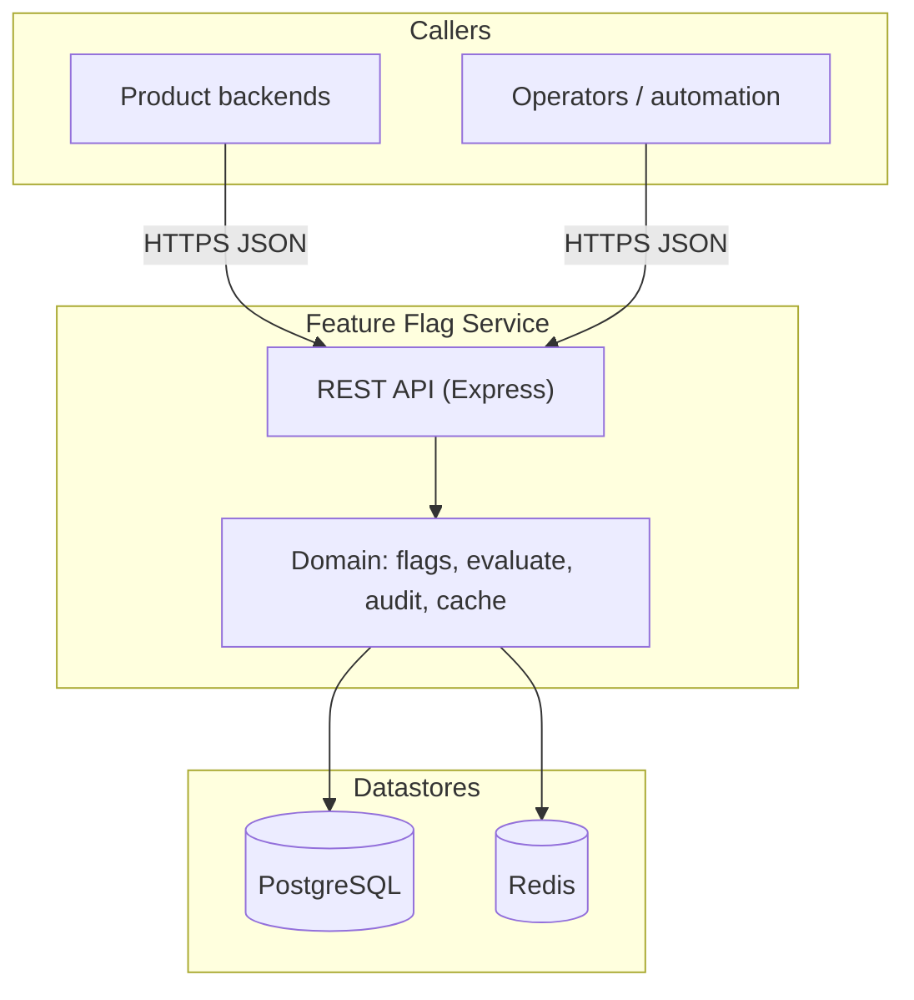
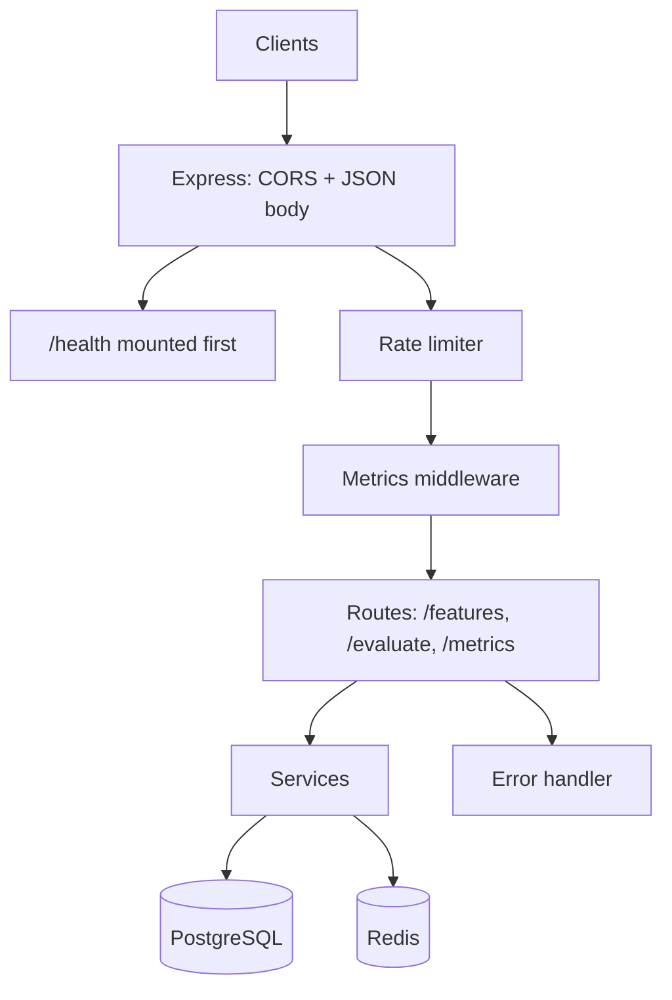

# Feature Flag Service

<<<<<<< HEAD


This project replicates how modern large-scale systems safely release and control features in production without requiring code redeployment. It demonstrates a real-world backend architecture where features can be dynamically toggled, gradually rolled out, and targeted to specific users or regions.

The system is designed with a strong focus on backend engineering principles, including clean API design, modular service-based architecture, deterministic evaluation logic, and performance optimization through caching. It also incorporates production grade concepts such as rate limiting to prevent abuse, centralized error handling for reliability, and metrics & observability to monitor system behavior.

Overall, this project serves as a practical implementation of scalable backend patterns used in companies like Amazon and Netflix, making it highly valuable for understanding real world system design.
=======
REST API for **managing and evaluating feature flags**: **PostgreSQL** as the source of truth, **Redis** for cache-aside reads and sliding-window **rate limiting**, **audit** rows on changes, **Zod** validation, and a deterministic **rollout** model with user/country allowlists.

[](https://nodejs.org/)
[](https://expressjs.com/)
[](https://www.postgresql.org/)
[](https://redis.io/)
[](https://zod.dev/)
[](#license)
>>>>>>> 92cab40 (Improvised Code Structure)

---

## Why this pattern matters (industry context)

<<<<<<< HEAD
Feature Flag Service is a backend system that enables **dynamic feature control without redeploying code**.

It allows developers to:
- Turn features ON/OFF instantly
- Roll out features gradually
- Target specific users or regions
- Monitor system behavior in real-time

This project mimics how large-scale systems (like Amazon, Netflix) safely release features in production.

---

## Features

### 1. Feature Management
- Create and update feature flags
- Environment-based configuration (`dev`, `prod`)
- Store targeting rules (users, countries)
- Supports gradual rollout using percentage

---

### 2. Feature Evaluation Engine
- Determines whether a feature should be enabled for a user
- Uses **deterministic hashing** for rollout consistency
- Supports:
  - User targeting
  - Country targeting
  - Percentage-based rollout

---

### 3. Redis Caching (Performance Optimization)
- Implements **cache-aside pattern**
- Reduces database load significantly
- Fast feature retrieval from cache
- Automatic cache invalidation on updates

---

### 4. Metrics & Observability
- Tracks:
  - Total API requests
  - Successful vs failed requests
  - Cache hits & misses
- Helps in understanding system performance

---

### 5. Rate Limiting (Sliding Window)
- Prevents API abuse
- Per-user rate limiting using `x-user-id`
- Implemented using **Redis sorted sets**
- Sliding window algorithm (production-grade)

---

### 6. Audit Logging
- Tracks all feature changes
- Stores:
  - Old values
  - New values
  - Action type (CREATE / UPDATE)
- Useful for debugging and traceability

---
## Project Structure

```bash
feature-flag-service/
│
├── config/
│   ├── db.js
│   └── redis.js
│
├── controllers/
│   ├── evaluationController.js
│   └── featureController.js
│
├── middleware/
│   └── errorHandler.js
│   └── metricsMiddleware.js
│   └── rateLimiter.js
│
├── routes/
│   ├── evaluationRoutes.js
│   └── featureRoutes.js
│   └── metricsRoutes.js
│
├── services/
│   ├── auditService.js
│   ├── cacheService.js
│   ├── evaluationService.js
│   └── featureService.js
│   └── metricsService.js
│
├── sql/
│   └── schema.sql
│
├── utils/
│   └── hash.js
│
├── .env
├── .gitignore
├── package-lock.json
├── package.json
└── server.js
=======
At scale, teams **decouple “deploy” from “release”**: code ships to production continuously, while **feature flags** decide what end users actually see. That is the same idea behind commercial **feature-management** platforms (LaunchDarkly, Split, Unleash, ConfigCat, etc.) and is standard in **progressive delivery**, **SRE**, and **platform engineering**.

| Theme | Why it matters |
|-------|----------------|
| **Risk & blast radius** | Turn features off instantly without a rollback deploy; roll out to a **%** of users before full GA. |
| **Velocity** | Product and engineering iterate without blocking on monolithic release trains. |
| **Experimentation** | Percentage rollouts and allowlists support A/B-style learning tied to metrics. |
| **Operational safety** | **Audit** trails and environment-scoped flags align with change-management and debugging in regulated or high-traffic systems. |
| **Performance & protection** | **Caching** and **rate limiting** mirror how real control planes stay fast and resilient under load. |

This repository is a **focused backend** that implements those building blocks—persistence, evaluation, cache, limits, and audit—so you can discuss the **same concepts** used in production feature-flag systems.

---

## Why this project

Feature flags let teams:

- Toggle behavior **without redeploying** the whole app
- **Roll out** to a percentage of users
- **Allowlist** specific user IDs or countries
- **Disable** a bad feature quickly

Typical usage: services call **`POST /evaluate`** at runtime; operators use **`POST` / `PUT` / `GET`** under `/features` to manage definitions.

---

## Features

| Area | Behavior |
|------|----------|
| **CRUD** | Flags keyed by **`name` + `environment`** (unique in DB) |
| **Evaluation** | Returns `enabled` plus a **`reason`** code (see [Evaluation logic](#evaluation-logic)) |
| **Redis cache** | Cache-aside for **single-flag GET**; response includes `source: "cache"` or `"database"` |
| **Audit** | `CREATE` / `UPDATE` rows in `audit_logs` with JSONB snapshots |
| **Rate limit** | Per-client sliding window (Redis sorted sets); **`GET /health`** excluded |
| **Metrics** | In-memory counters (`/metrics`); request middleware skips `/health` and `/metrics` |
| **Validation** | **400** with structured errors from **Zod** |

---

## Tech stack

| Layer | Technology |
|-------|------------|
| Runtime | **Node.js** (18+) |
| HTTP | **Express 5** |
| Database | **PostgreSQL** via **`pg`** connection pool |
| Cache & limits | **Redis** (`redis` v5): feature cache + rate limiter |
| Validation | **Zod** |
| Config | **dotenv** — loads `.env` from the project folder with **`override: true`** so file wins over stray shell exports |
| CORS | **`cors`** |

---

## Architecture

### High-level system view

Callers (applications, scripts, gateways) talk to this **HTTP API** only. **PostgreSQL** holds durable flag definitions and audit history; **Redis** accelerates hot reads and enforces per-client rate limits.



- **Read path:** evaluation and single-flag reads may hit Redis first (cache-aside), then Postgres on miss.
- **Write path:** creates/updates go to Postgres; cache entries are updated or invalidated.
- **Cross-cutting:** rate limiting and metrics sit in front of business routes; **`/health`** is excluded from rate limits for probes.

### In-process request flow



### Layers

- **Routes** — URL → controller.
- **Controllers** — parse params/query/body; HTTP status codes.
- **Services** — business logic: flags, evaluation, cache, audit, metrics.
- **Middleware** — rate limit, metrics, global error handler, Zod validators on routes.

### Redis key patterns

| Prefix | Purpose |
|--------|---------|
| `feature:{environment}:{name}` | Cached JSON for one flag |
| `rate_limit:{identity}` | Sorted set of request timestamps for sliding window |

`identity` = `x-user-id` header if set, else IP / socket address.

---

## Data model

Defined in **`sql/schema.sql`** — apply with:

```bash
psql "$DATABASE_URL" -f sql/schema.sql
```

### `feature_flags`

| Column | Notes |
|--------|--------|
| `name`, `environment` | Unique together |
| `enabled` | Master switch |
| `rollout_percentage` | 0–100 |
| `target_users`, `target_countries` | JSONB **arrays** (allowlists) |
| `created_at`, `updated_at` | Timestamps |

### `audit_logs`

| Column | Notes |
|--------|--------|
| `feature_name`, `environment`, `action` | `CREATE` / `UPDATE` |
| `old_value`, `new_value` | JSONB snapshots |

---

## How caching works

- **Pattern:** **Cache-aside** (read-through on miss).
- **Cached route:** only **`GET /features/:environment/:name`**.
- **Not cached:** **`GET /features`** (list) always hits Postgres. **`POST /evaluate`** calls the same `getFeature` service, so it **benefits** from the same Redis cache when a flag was loaded recently.

**Redis key:** `feature:{environment}:{name}` (e.g. `feature:prod:dark_mode`).

On writes, the key is built from the **same** `name` and `environment` as the HTTP layer (not inferred only from row fields), so **GET** and **SET** always align.

**Flow:** `GET` → Redis `GET` → on miss, Postgres `SELECT` → Redis `SET` with TTL **`FEATURE_CACHE_TTL_SECONDS`** (default 300s) → response `source: "database"`. Next identical `GET` → `source: "cache"` until TTL expires or flag is updated.

**`SKIP_CACHE`:** When `true` / `1` / `yes` / `on`, Redis is skipped for feature payloads (always Postgres). **False** / **0** / **off** / unset → use Redis.

**`CACHE_LOG`:** When not `false`, server logs lines like `[cache] MISS`, `HIT`, `SET ok` for debugging.

---

## How rate limiting works

- **Algorithm:** **Sliding window** in Redis (sorted set scores = request timestamps).
- **Skipped:** **`GET /health`** only (health checks stay cheap).
- **Steps:** Remove expired scores → `ZCARD` → if `count >= MAX` return **429** with **`Retry-After`** (do not record the rejected request) → else `ZADD` + `EXPIRE`.
- **On Redis error:** middleware **fail-opens** (`next()`) so the API stays available.

**Important — two different env vars:**

| Variable | Meaning |
|----------|---------|
| `RATE_LIMIT_WINDOW_SECONDS` | **Length** of the window in **seconds** (e.g. `60` = one minute). |
| `RATE_LIMIT_MAX_REQUESTS` | **How many requests** are allowed **inside** that window per identity. |

Do **not** swap them (e.g. `WINDOW=3` and `MAX=100` means “100 requests every 3 seconds.”).

---

## Evaluation logic

`POST /evaluate` body: `featureName`, `environment`, optional `userId`, optional `country` (2-letter, uppercased).

**Order of checks:**

1. Flag missing → `enabled: false`, `reason: FEATURE_NOT_FOUND`.
2. `enabled === false` → `FEATURE_DISABLED`.
3. `userId` in `target_users` → `TARGET_USER_MATCH`.
4. `country` in `target_countries` → `TARGET_COUNTRY_MATCH`.
5. Rollout needed but no `userId` → `USER_ID_REQUIRED_FOR_ROLLOUT`.
6. **Rollout:** `bucket = simpleHashToPercentage(\`${featureName}:${userId}\`)` → integer **0–99**. If `bucket < rollout_percentage` → `ROLLOUT_MATCH` (else `ROLLOUT_MISS`).

Same user + same flag always gets the same bucket (sticky, no flicker).

---

## Metrics & health

- **`GET /metrics`** — in-memory: `totalRequests`, `successRequests`, `failedRequests`, `cacheHits`, `cacheMisses`. Resets on process restart.
- **`GET /health`** — pings Postgres (`SELECT 1`) and Redis (`PING`); **200** if both OK, **503** if degraded. Not rate-limited.

---

## API reference

Base URL: `http://localhost:3000` (or your `PORT`).

| Method | Path | Success | Common errors |
|--------|------|---------|----------------|
| `GET` | `/` | **200** banner | — |
| `GET` | `/health` | **200** ok / **503** degraded | — |
| `POST` | `/features` | **201** created | **400** validation |
| `GET` | `/features` | **200** list | **400** bad `?environment=` |
| `GET` | `/features/:environment/:name` | **200** `{ feature, source }` | **404** |
| `PUT` | `/features/:environment/:name` | **200** | **400** empty body, **404** |
| `GET` | `/features/audit/logs` | **200** paginated | **400** bad `limit`/`offset` |
| `POST` | `/evaluate` | **200** evaluation result | **400** |
| `GET` | `/metrics` | **200** counters | — |

**Global:** other routes may return **429** with `Retry-After` when over the rate limit (see [How rate limiting works](#how-rate-limiting-works)).

---

## Environment variables

| Variable | Description |
|----------|-------------|
| `PORT` | HTTP port (default `3000`) |
| `HOST` | Bind address (default `0.0.0.0`) |
| `DATABASE_URL` | Postgres URL (preferred), or use `PG*` / `DB_*` discrete vars |
| `REDIS_URL` | Redis URL |
| `RATE_LIMIT_WINDOW_SECONDS` | Sliding window length (**seconds**) |
| `RATE_LIMIT_MAX_REQUESTS` | Max requests per window per `x-user-id` or IP |
| `FEATURE_CACHE_TTL_SECONDS` | Redis TTL for cached flag JSON |
| `SKIP_CACHE` | Disable feature cache when truthy (`true`/`1`/`yes`/`on`) |
| `CACHE_LOG` | Verbose `[cache]` logs when not `false` |

Copy **`.env.example`** to **`.env`** and edit. **Never commit `.env`** (it is gitignored).

---

## Quick start

**Requirements:** Node.js 18+, PostgreSQL, Redis.

1. **Install**

   ```bash
   git clone <repo-url>
   cd feature-flag-service
   npm install
   ```

2. **Configure**

   ```bash
   cp .env.example .env
   ```

   Set **`DATABASE_URL`** (or `PGUSER` / `PGHOST` / `PGDATABASE`, etc.) and **`REDIS_URL`**.

3. **macOS (Homebrew) example**

   ```bash
   brew install postgresql@16 redis
   brew services start postgresql@16
   brew services start redis
   createdb feature_flags
   ```

   Use `DATABASE_URL=postgresql://$(whoami)@localhost:5432/feature_flags` if your local Postgres accepts peer auth.

4. **Schema**

   ```bash
   set -a && source .env && set +a
   psql "$DATABASE_URL" -f sql/schema.sql
   ```

5. **Run**

   ```bash
   npm start
   ```

   Server listens on **`PORT`**; connect Redis before starting. Startup logs show effective rate limits and whether the feature cache is enabled.

---

## Testing the API

Set a base URL once per shell: **`export BASE=http://localhost:3000`**

```bash
# Health
curl -sS "$BASE/health" | jq .

# Create a flag
curl -sS -X POST "$BASE/features" -H "Content-Type: application/json" \
  -d '{"name":"demo","environment":"prod","enabled":true,"rollout_percentage":50}' | jq .

# Single-flag GET (first: database, second: cache if Redis + cache enabled)
curl -sS "$BASE/features/prod/demo" | jq .source
curl -sS "$BASE/features/prod/demo" | jq .source

# Evaluate
curl -sS -X POST "$BASE/evaluate" -H "Content-Type: application/json" \
  -d '{"featureName":"demo","environment":"prod","userId":"user-1"}' | jq .

# Metrics
curl -sS "$BASE/metrics" | jq .
```

To see **429** on the rate limiter, set **`RATE_LIMIT_MAX_REQUESTS=2`** (and **`RATE_LIMIT_WINDOW_SECONDS=60`**) in `.env`, restart, then send the same `curl` to `/features` repeatedly with the same **`x-user-id`** until the limit is exceeded.

---

## Troubleshooting

| Issue | What to check |
|-------|----------------|
| `curl: (7) Failed to connect` | **`npm start`** is running; keep that terminal open or use a second terminal for `curl`. |
| `URL rejected: No host part` | **`export BASE=http://localhost:3000`** before using `$BASE` in curl. |
| Always `source: database` for GET | **`SKIP_CACHE`** in `.env`; Redis running; **`[cache]`** logs if `CACHE_LOG` is on. |
| Rate limit never triggers | **`RATE_LIMIT_MAX_REQUESTS`** vs **`RATE_LIMIT_WINDOW_SECONDS`** — see [How rate limiting works](#how-rate-limiting-works). Restart after `.env` changes. |
| `/health` **503** | Postgres URL or Redis down / wrong URL. |

---

## Project structure

```text
config/           db.js, redis.js
controllers/      HTTP handlers
middleware/       errorHandler, rateLimiter, metricsMiddleware, validate (Zod)
routes/           feature, evaluation, metrics, health
services/         feature, evaluation, cache, audit, metrics
validators/       Zod schemas
utils/            hashing, feature target helpers
sql/schema.sql    PostgreSQL DDL
```

---

## Scripts

| Command | Description |
|---------|-------------|
| `npm start` | Run `node server.js` |
| `npm run dev` | `nodemon server.js` (reload on file changes) |

---

## License

ISC
>>>>>>> 92cab40 (Improvised Code Structure)
